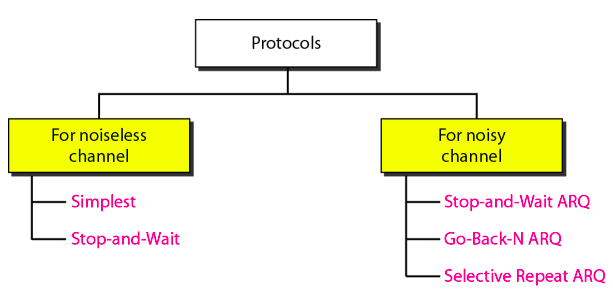
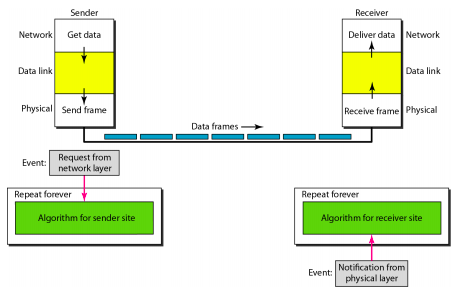
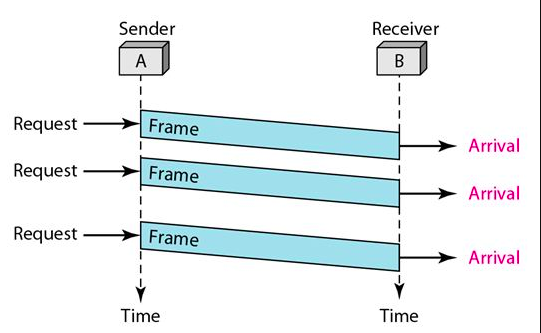
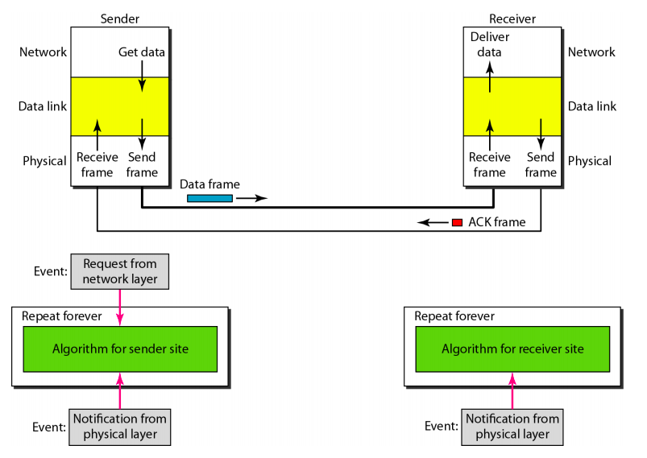
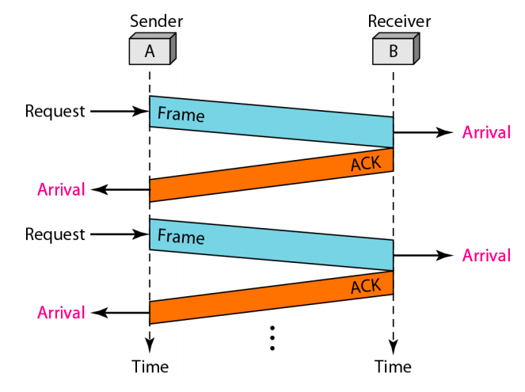

# Data Link Layer Protocols

DLL combines framing, flow control, and error control into a **protocol** to achieve the delivery of data from one node to another.

Protocols for Data Link Layer are divided into two categories - 

1. For noiseless channel - Unrealistic, used only for understanding protocols for noisy channels.
2. For noisy channel.

 

All these protocols are unidirectional, and not used in real life.


## Noiseless Channels Protocols

Noiseless channels protocols assumes that the channel is ideal and *no frames are lost, duplicated, or corrupted.*

**Protocols** in these category:

1. Simplex/Simplest Protocol
2. Stop-and-wait protocol

### Simplest Protocol

> Also known as Simplex Protocol

Simplex Protocol assumed that the channel is error free and the receiver has unlimited buffer and speed therefore it can handle any frame immediately.

- No Error Control.

- No Flow Control.



#### Pseudo Code for Simplest Protocol:

- **Sender:**

  ```pseudocode
  while (true)			// Repeat Forever
  {
  	WaitForEvent();		// Sleep until an event occurs
  	if (Event(RequestToSend))	// There is a packet to send
  	{
  		GetData();
  		MakeFrame();
  		SendFrame();		// Send the frame
  	}
  }
  ```

  Explanation: This is an always running *event-driven* algorithm that will wait until a request from network layer is received for sending a packet and then create Frame and transmit it to the receiver's data link layer using the service provided by the physical layer.

- **Receiver**:

  ```pseudocode
  while (true)		// Repeat forever
  {
  	WaitForEvent();		// Sleep until an event occur
  	if (Event(ArrivalNotification))	// Data frame arrived
  	{
  		ReceiveFrame();		
  		ExtractData();
  		DeliverData();	// Deliver data to Network layer
  	}
  }
  ```

  Explanation: This is an always running *event-driven* algorithm that waits until a notification of new frame is received from the physical layer. It then *extract the data* from the frame and deliver it to its network layer.

#### Flow Diagram for Simplest Protocol



### Stop-and-Wait Protocol

This protocol assume the channel to be error free but the receiver has a limited buffer for the storage of frames (Receiver needs to store frame as they generally arrives faster than they can be processed).

This may result in discarding of frames therefore overburdening of receiver must be prevented using the *flow control mechanism*.

- No Error Control :negative_squared_cross_mark:
- Does Flow Control :white_check_mark:

> The sender sends one frame, **stops** until it receives a confirmation from the receiver and then sends the next frame.

For confirmation of successful receiving of frames the receiver sends **auxiliary** frames called **ACK** (for acknowledgement) Frames. Half duplex link used for communication.



#### Pseudo Code for Stop-and-Wait Protocol

- **Sender:**

  ```pseudocode
  canSend = true;		// Allow the first frame to go
  while (true)	// Repeat forever
  {
  	WaitForEvent();		// Sleep until event occurs
  	if (Event(RequestToSend) AND canSend)	
  	{
  		GetData();
  		MakeFrame();
  		SendFrame();	// Send the data frame
  		canSend = false;	// Cannot send until ACK arrives
  	}
  	WaitForEvent();
  	if (Event(ArrivalNotification))	// An ACK arrived
  	{
  		ReceiveFrame();	// Receive the ACK frame
  		canSend = true;// Reset canSend to True to send next Frame
  	}
  }
  ```

  Explanation: This is an always running event driven algorithm, it will wait until either one of the two events happens. The responses to these two events will alternate, first network layer will request sending of a packet and it will sent after making frame and then no new frame will be sent unless an acknowledgement frame is received from the receiver.

- **Receiver:**

  ```pseudocode
  while (true)	// Repeat forever
  {
  	WaitForEvent();	// Sleep until an event occurs
  	if (Event(ArrivalNotification))	// Data frame arrives
  	{
  		ReceiveFrame();	
  		ExtractData();
  		DeliverData();	// Deliver data to network layer
  		SendFrame();	// Send an ACK frame
  	}
  }
  ```

  Explanation: This is an always running event driven algorithm it will wait until it receives a frame notification from physical layer, after that it will extract the data deliver it to its network layer and send an acknowledgement frame to the sender, so that sender can send the next frame.
  
- **Flow Diagram:**

  

## Noisy Channel Protocols

Noisy channels has the possibility of errors, so they must also be handled together with flow control.

Protocols in this category:

1. Stop-and-Wait Automatic Repeat Request
2. Go-Back-N Automatic Repeat Request
3. Selective Repeat Automatic Repeat Request

### Stop-and-Wait Automatic Repeat Request

Also called as Stop-and-Wait ARQ. This protocol adds a simple *error control* mechanism to the Stop-and-Wait protocol.

- Error Control :white_check_mark:
- Flow Control :white_check_mark:


