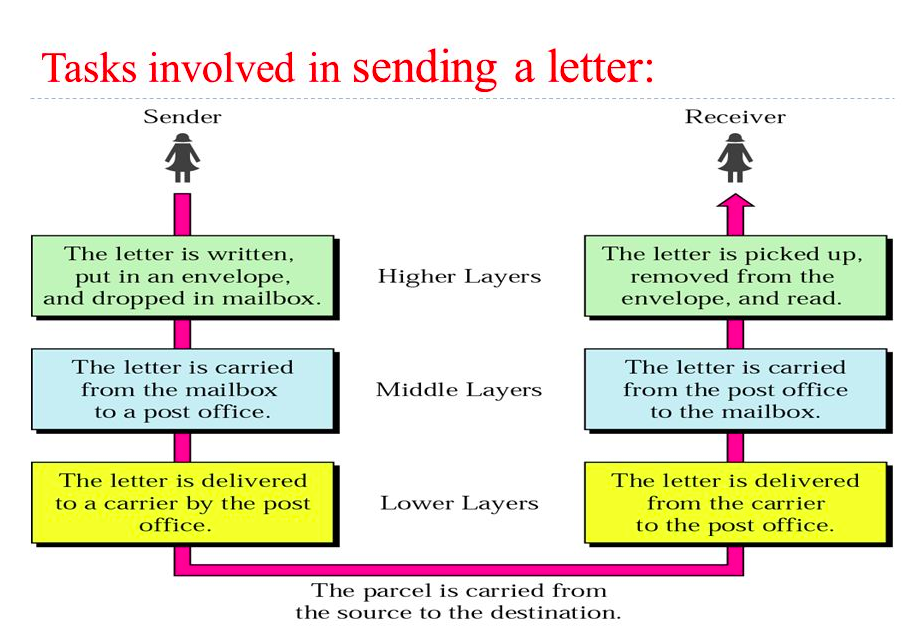
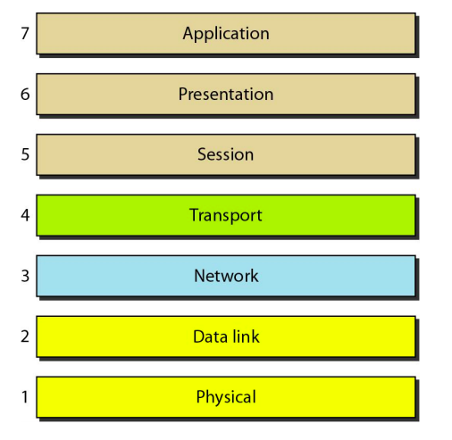
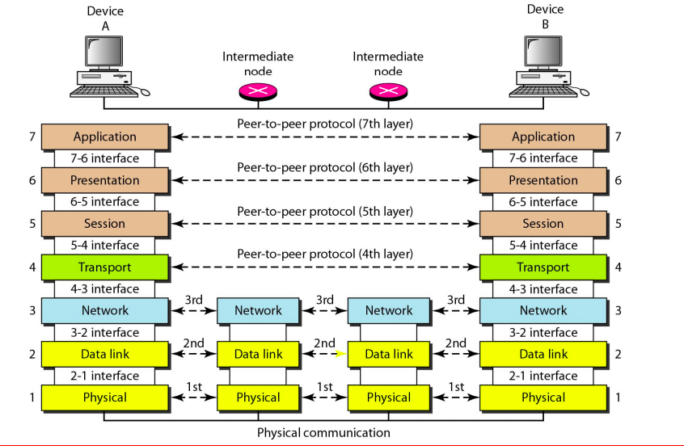
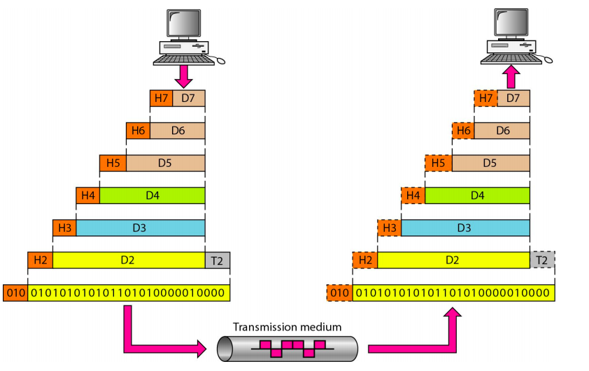

# Network Models

A network is a combination of hardware and software that sends data from one location to another.

The hardware consists of physical equipment that carries *signal* from one point of the network to another. The software consist of *instructions* sets that make possible the services that we expect from a network.

The task of sending data from one point in the network to another can be broken down into several sub-tasks performed by different *layers* in the network providing abstraction as we move upwards in layers.

## Layered Tasks

Let's understand how we use layers to accomplish a certain task in our daily like.

Consider two friends who communicate through postal mail. Tasks involved in sending a letter from **sender** to **receiver** can be done using the following layers:

The process involves a sender, a receiver, and a carrier. Each task must be done in the order given in the **hierarchy** meaning that a letter cannot be picked by the letter carrier in the third layer until it is not dropped by the sender in the mailbox.

Each layer provides a particular **service** and depends on the service provided by the layer below it.

There are two Network Models:

- **The OSI Model**
- **The TCP/IP Model**

## The OSI Model

The **Open Systems Interconnection** (OSI) Model is an **International Standard Organisation**(ISO) standard that covers all aspects of network communication.

The OSI model is a *layered framework* for the design of network systems that allows communication between all types of computer systems regardless of their underlying architecture.

The OSI model is used for understanding and designing a network architecture that is flexible, robust, and interoperable.

*The OSI model consists of 7 separate but related layers, each of which defines a part of the process of moving information across a network.*

### Layers in the OSI Model

The OSI Model consists of 7 ordered layers (shown above), each layer defines a family of functions distinct from those of the other layers. This **Layered Architecture** is comprehensive and flexible allowing complete interoperability between otherwise incompatible devices.

Within a single machine, each layer call upon the services of the layer below it. Between machines, layer x of one machine communicates with layer x of another machine.

This communication is governed by agreed-upon *rules and conventions* called **protocols**.

### Communication between machines

As the message travels from A to B, it may pass through many intermediate nodes. These intermediate nodes usually involve only the first three layers of the OSI model.

The processes on each machine that communicates at a given layer are called *peer-to-peer* processes. Communication between machines is therefore a peer-to-peer process using the protocols appropriate to a given layer.

At **Physical Layer**, communication is direct. device A sends a stream of bits to device B(through intermediate nodes).

At **Higher Layers**, communication must move down through layers on A, over to device B, and then back up through layers of B.

Each layer in the sending device adds its information to the message it receives from layers above it and passes the whole package to the layer below it.

Layer 1 (Physical Layer) converts the message to a form that can be transmitted(electrical, optical, etc) to the receiving device.

Each layer in the receiving device, unwraps the message layer by layer, with each process receiving and removing the data meant for it and moving it upwards.

**Interface between layers**: The passing of the data and network information down through the layers of the sending device and back up through the layers of the receiving device is made possible by an *interface* between each pair of adjacent layers.

*An Interface between layers define the information and services a layer must provide for the layer above it*. This provides modularity to a network, the specific implementation of a layer can be modified without requiring a change to surrounding layers as long as the layers provide the expected services to the layer above it.

**Organization of layers**: 

The layers can be divided into three subgroups:

1. Layers 1, 2, 3 dealing with physical aspects of moving data.
   - Physical Layer(1), Data Link Layer(2), Network Layer(3).
   - Deals with the electrical specification, physical connections, physical addressing, and transport timing and reliability.
   - Implemented with a combination of hardware and software.
2. Layers 5, 6, 7 dealing with the user aspect of moving data.
   - Session Layer(5), Presentation Layer(6), Application Layer(7).
   - Allows interoperability among unrelated software systems.
   - Implemented with mostly software.
3. Layer 4 links the two subgroups.
   - Transport Layer(4).
   - Ensures that message from lower layers is transmitted in a form that the upper layers can use.

The above diagram demonstrates how each layer in the sending device adds a **header** or possibly a **trailer**, to the data unit received from the layer above it.

The physical layer transforms the data into an electromagnetic signal and transport along with a *physical link*. On destination, the signal passes into layer 1 and is transformed back into digital form.

The data units then move back up through OSI layers and the headers and trailers attached to the corresponding layers are removed and action appropriate to that layer is taken, upon reaching the layer 7 on the receiving device the message again in a form appropriate to the application and is made available to the recipient.

**Encapsulation**: A layer N - 1 is not aware of which part of the packet it receives from layer N is data and which part is header or trailer. For N - 1, the whole packet coming from layer N is treated as one integral unit.

---

To learn more about each layer and its functions, read - [Layers of OSI Model](./layers-osi-model-2.md)

---

#### Thanks

