# Layers In the OSI Model

Note: In this article, we have discussed layers in the OSI model, for introduction to the OSI model refer to [this article](./Network-Models-1.md).

---

Let's discuss each of the following layers of the OSI model:

1. Physical Layer.
2. Data Link Layer.
3. Network Layer.
4. Transport Layer.
5. Session Layer.
6. Presentation Layer.
7. Application Layer.

## Physical Layer

The physical layer is the lowest layer of the OSI model, responsible for sending bits from one computer to another through a **physical medium**. It deals with the setup of physical connection to the network and with transmission and reception of signals. It also defines the functions that physical devices and interfaces have to perform for transmission to occur.

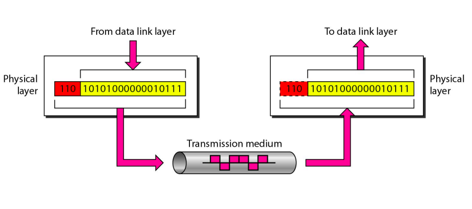

**The Physical Layer is responsible for the movement of individual bits from one node(hop) to the next.**

Functions of Physical Layer

1. **Representation of Bits** - defines how the stream of bits is encoded into signals for transmission i.e. how 0s and 1s are changes to signal.
2. **Data Rate** - defines the rate of transmission i.e. the number of bits sent per second.
3. **Synchronization** - does the synchronization of bits by providing a *clock*. The clock controls both sender and receiver thus providing synchronization at a bit level. One bit is transmitted or received during each clock cycle.
4. **Interface** - defines the transmission interface between devices and transmission medium. For example - which electrical connectors and cables to use are defined by the physical layer.
5. **Line configuration** - Connects device with the medium through either *point to point* configuration or *multipoint* configuration.
6. **Topologies** - defines the topology to use - bus, star, mesh, or ring.
7. **Transmission Modes** - defines the direction of transmission between two devices: **Simplex**(One-way communication), **Half Duplex**(Two-way communication but one at a time), **Full Duplex**(Two-way simultaneous communication).

## Data Link Layer (DLL)

The data link layer is responsible for the **node to node**(or hop to hope) delivery of the message. It makes sure data transfer is error-free from one node to another, over the physical layer. 

The data link layer is concerned for delivery on the same network between two directly connected nodes like in LAN.

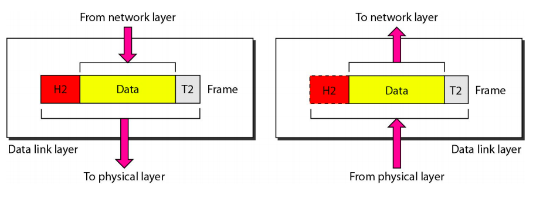

**The data link layer is responsible for moving frames from one hop to the next.**

Functions of the Data Link Layer:

1. **Framing** - The data link layer divides the stream of bits received from the network layer into manageable *data units* called **frames**.

2. **Physical Addressing** - After creating frames, DLL adds **physical addresses**(MAC address) of the sender and receiver in the header of each frame.

   - If the frame is intended for a system outside the sender's network, the receiver address is the address of the device that connects the network to the next one.

3. **Flow Control** - If the rate at which the data are *absorbed* by the receiver is less than the rate at which data are *produced* in the sender, the data link layer imposes a flow control mechanism to avoid overwhelming the receiver.

   Example - If the sender can send 5 frames per second but the receiver can only receive 3 frames per second the data link layer will reduce the frames from 5 to 3 per second on the sender's side.

4. **Error Control**  - The DLL adds **reliability** to the physical layer by adding mechanisms to detect and retransmit damaged or lost frames. It also uses a mechanism to recognize duplicate frames.

   **Error Control is achieved through a trailer added to the end of the frame**.

5. **Access Control** - When two or more devices are connected to the same link, data link layer protocols are necessary to determine which device has control over the link at any given time.

   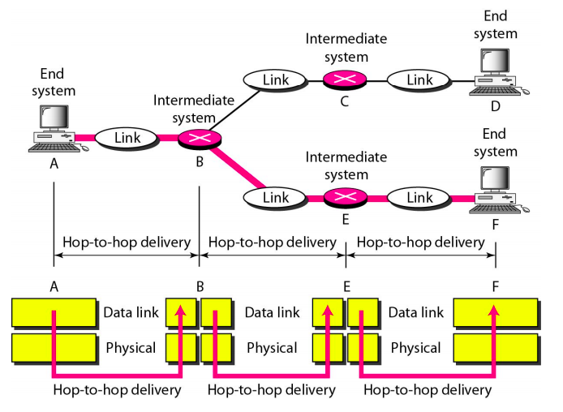

## Network Layer

**The network layer is responsible for the *source to destination* delivery of a *packet*, possibly across multiple networks(links).**

Whereas the data link layer oversees the delivery of the packet between two systems on the same network(links), the network layer ensures that each packet gets from its point of origin to its final destination.

> If two systems are connected to the same link, there is usually no need for a network layer. However, if the two systems are attached to different networks (links) with connecting devices between the networks (links), there is often a need for the network layer to accomplish source-to-destination delivery.

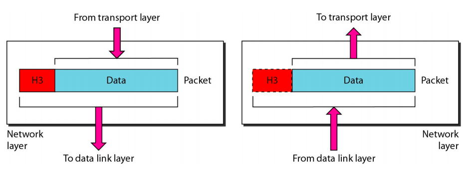

Functions of Network Layer:

1. The network layer is responsible for the source to destination delivery of a packet across multiple networks.

2. **Logical addressing** - Network layers allocate a unique address called IP address to the header of the packet to distinguish each device.

   > The DLL adds a physical address to identify devices locally, the IP address identifies devices universally.

3. **Routing** - The network layer determines which **route** is suitable from source to destination across multiple networks.

   The device which implements routing at the network layer is known as **router** or a switch.

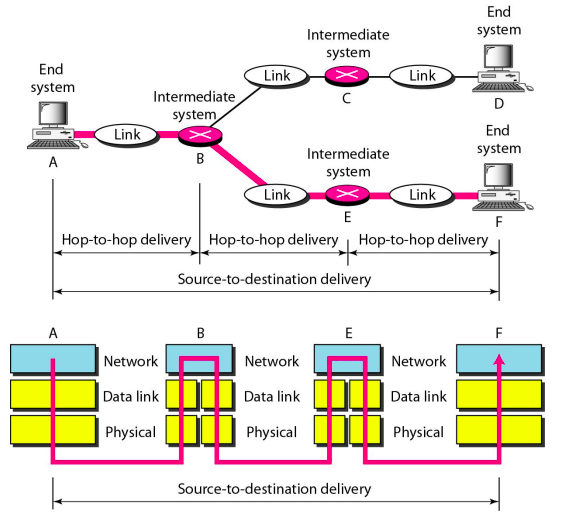

## Transport Layer

The transport layer is responsible for **process to process** delivery of the entire message.

A process is an application program running on a host. Whereas the network layer oversees source to destination delivery of individual packets, it does not recognize any relationship between those packets and treats them individually as though each piece belonged to a separate message, whether or not it does.

The transport layer, on the other hand, ensures that the whole message arrives intact and in order, overseeing both *error control* and *flow control* at the source to destination level.

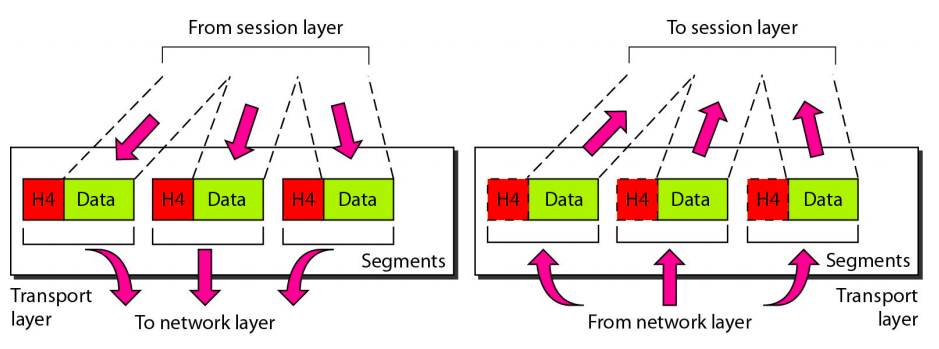

> The transport layer is responsible for the delivery of a message from one process to another.

Functions of Transport Layer:

1. **Service Point Addressing/Port Addressing** - The transport layer header includes the **port address**(a 16-bit address allocated to every process) which delivers a message from a specific process on one computer to another process on another computer.

   *The network layer gets each packet to the correct computer; the transport layer gets the entire message to the correct process on that computer.*

2. **Segmentation and Reassembly** - A message is divided into *transmittable* segments, with each segment containing a sequence number. The receiver transport layer uses these numbers to reassembles segments and replace packets that were lost in the transmission.

3. **Connection Control** - The transport layer can be either **connectionless** or **connection-oriented**.

   - Connectionless - a connectionless transport layer treats each segment as an independent packet and delivers it to the transport layer at the destination machine.
   - Connection-Oriented - a connection-oriented transport layer makes a connection with the transport layer at the destination machine before delivering the packets.

4. **Flow Control** - Like DLL, the transport layer is responsible for flow control. However, flow control at this layer is performed end to end rather than across a single link.

5. **Error Control** - Like DLL, Transport Layer also performs error control. However, error control at this layer is performed process to process rather than across a single link.

   - The sending transport layer makes sure that the entire message arrives at the receiving transport layer without error(damage, loss, or duplication).

   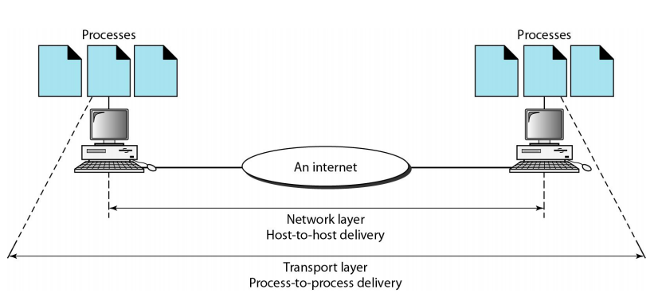

## Session Layer

**The session later is responsible for dialog control and synchronization.**

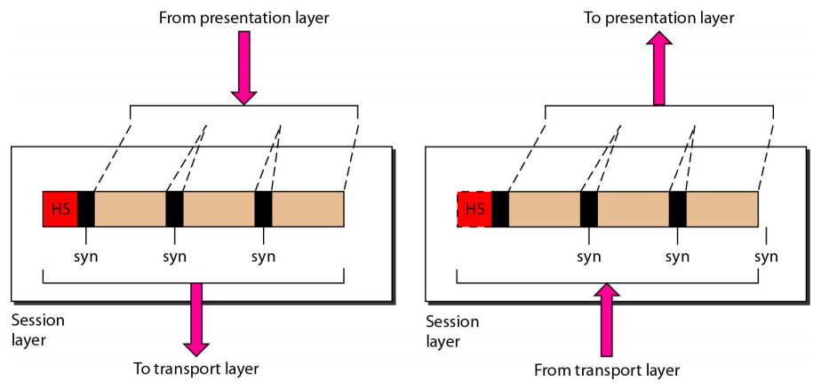

Functions of Session Layer - 

1. **Session establishment, maintenance, and termination:** The layer allows the two processes to establish, use and terminate a connection.
2. **Dialog Control** - The session layer allows two systems to enter into a dialog. It allows the communication between two processes to take place in either half-duplex(one way at a time) or full-duplex(two ways at a time) mode.
3. **Synchronization** - The session layer allows a process to add **checkpoints** or **synchronization points** to a stream of data.
   - For Example - if a system is sending a file of 2000 pages, it is advisable to insert checkpoints after every 100 pages to ensure that each 100-page unit is received and acknowledged independently. In this case, if a crash happens during the transmission of page 523, the only pages that need to be resent after system recovery are pages 501 to 523.
   - Using checkpoints helps to reduce bandwidth wastage.

## Presentation Layer

The Presentation Layer is concerned with the syntax and semantics of the information exchanged between two systems.

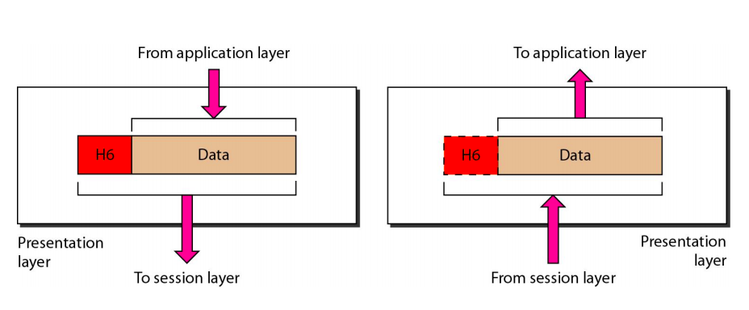

**The Presentation Layer is responsible for translation, compression, and encryption.**

Functions of Presentation Layer - 

1. **Translation** - The Presentation Layer translates the exchanging information into a compatible format between the sender and receiver as they may be using different formats. Example ASCII to Unicode.
2. **Encryption** - The presentation Layer uses some algorithms(like RSA, AES) for encrypting the information before sending it to the receiver, and decryption on the receiver side reverses the original process to transform the message back to its original form.
3. **Compression** - Presentation Layer compresses(reduce) the number of bits contained in the information using some algorithms.
   - Data compression is particularly important for transmitting multimedia.
   - There are two types of compression:
     1. Lossy - restores compression with loss of data but it is non-noticeable.
     2. Lossless - restores compression without loss of data.

## Application Layer

The application layer enables the user, whether human or software, to access the network.

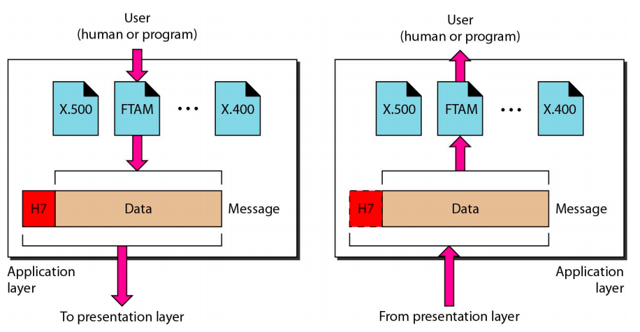

**The application layer is responsible for providing services to the user.**

Example of services:

1. Network virtual terminal - allows users to log on to a remote host.
2. File transfer, access, and management.
3. Mail services.
4. Directory services.

## Summary of Layers

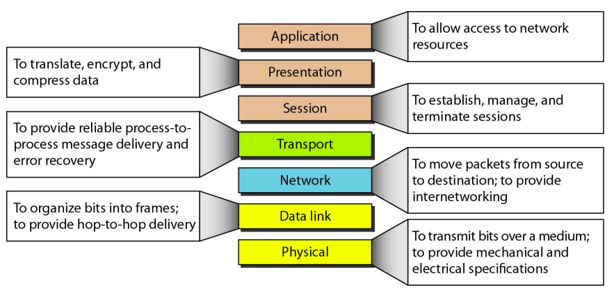

---

**References**

1. DATA COMMUNICATIONS AND NETWORKING, Behrouz A. Forouzan, 4th edition.
2. [Studytonight.com - The OSI Model - Features, Principles, and Layers](https://www.studytonight.com/computer-networks/complete-osi-model)
3. [GeeksforGeeks - Layers of OSI Model]([https://www.geeksforgeeks.org/layers-of-osi-model/#:~:text=Bit%20synchronization%3A%20The%20physical%20layer,of%20bits%20sent%20per%20second.](https://www.geeksforgeeks.org/layers-of-osi-model/#:~:text=Bit synchronization%3A The physical layer,of bits sent per second.))

---

#### Thanks

